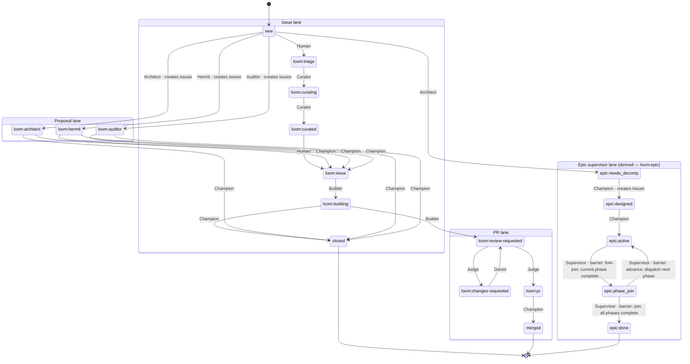

# Loom

[](https://codecov.io/gh/rjwalters/loom)
[](https://github.com/rjwalters/loom/releases)
[](https://github.com/rjwalters/loom)

**AI-powered development orchestration using your forge as the coordination layer.**

Loom spawns AI agents that claim issues, implement features, review PRs, and merge code -- all coordinated through labels. Your only job: write issues, review PRs, merge what you like.

**Supported Forges**: GitHub | Gitea — Loom auto-detects your forge from the git remote URL. A forge abstraction layer — `defaults/scripts/lib/forge-helpers.sh` for shell scripts, plus the Rust `loom-daemon/src/forge_*.rs` modules for the daemon — makes the workflow identical regardless of forge.

## Quick Start

```bash
# Clone and install to your repository
git clone https://github.com/rjwalters/loom
cd loom
./install.sh /path/to/your/repo

# Start autonomous development on a single issue from Claude Code
cd /path/to/your/repo
# In Claude Code:
/loom:sweep 42
```

For multiple issues in one session, pass them all to sweep:

```bash
# In Claude Code:
/loom:sweep 42 43 44          # waves of parallel builders
/loom:sweep all               # the whole open backlog
```

For continuous multi-account batches, run the `loom-daemon` (Tier 2) and enqueue with `mcp__loom__dispatch_sweep` — one detached, token-rotated sweep per issue.

## How It Works

```
┌─────────────────────────────────────────────────────────────────┐
│                    Human (Tier 3)                               │
│  Write issues, review PRs, merge what you approve               │
└─────────────────────────────────────────────────────────────────┘
                              │
┌─────────────────────────────────────────────────────────────────┐
│        Tier 2: loom-daemon + GitHub Actions cron                │
│  loom-daemon dispatches per-issue sweeps (mcp__loom__*)         │
│  .github/workflows/loom-*.yml runs support roles on cron        │
└─────────────────────────────────────────────────────────────────┘
                              │
┌─────────────────────────────────────────────────────────────────┐
│        Tier 1: /loom:sweep <issue>                              │
│  Single-issue lifecycle: Curator → Builder → Judge → Doctor →   │
│  Merge. Checkpoints survive crashes.                            │
└─────────────────────────────────────────────────────────────────┘
                              │
┌─────────────────────────────────────────────────────────────────┐
│                    Workers (Tier 0)                             │
│  /loom:builder, /loom:judge, /loom:curator, /loom:doctor        │
│  - Execute single tasks                                         │
└─────────────────────────────────────────────────────────────────┘
```

**Label-driven workflow:**
- `loom:issue` → Ready for implementation
- `loom:building` → Being worked on
- `loom:review-requested` → PR ready for review
- `loom:pr` → Approved, ready to merge

See [WORKFLOWS.md](docs/workflows.md) for complete label documentation.

## Loom State Machine

Loom coordinates its agents entirely through labels. The full label graph below
— four lanes (issue, PR, proposal, epic supervisor), the role that fires each
edge, and the epic fork-join barriers — is hand-maintained documentation kept
in sync with the code by reviewers, not regenerated from a model.

The epic-supervisor lane is the one lane with a Rust implementation:
[`loom-daemon/src/epic_state.rs`](loom-daemon/src/epic_state.rs)'s
`epic_transition_table()` is authoritative for its five states and five edges,
and `loom-daemon/tests/epic_state_invariants.rs` asserts its structural
invariants directly (state count, sole terminal state, edge count, barrier
hygiene). The five `epic:*` states are **derived** — they all ride the single
`loom:epic` label and are computed by the daemon-native epic supervisor, so no
new labels are minted. Edges marked "creates issues" are the ones the #3707
issue-filing mutex must serialize.



## Features

**Autonomous Orchestration**
- Rust `loom-daemon` DispatchSweep IPC for deterministic, reliable execution
- Stuck agent detection with automatic kill-and-retry recovery
- Rate limit resilience with exponential backoff
- Activity-based completion detection

**Quality Gates**
- Acceptance criteria verification before PR creation
- Automated code review with `/loom:judge`
- PR conflict resolution with `/loom:doctor`
- Main branch validation with `/loom:auditor`

**Forge-Agnostic**
- Works with GitHub and Gitea out of the box
- Auto-detects forge from git remote URL
- Forge abstraction layer (`forge-helpers.sh` + `loom-daemon/src/forge_*.rs`)
- Forge-neutral caching layer for API efficiency

**Developer Experience**
- Git worktree isolation per issue
- Simple slash command: `/loom:sweep 42` runs a single issue end-to-end
- MCP integration for programmatic control (30 tools)
- Crash-safe checkpoints: restart `/loom:sweep N` to resume from the last completed phase

## Forge Support

Loom's forge abstraction layer — `defaults/scripts/lib/forge-helpers.sh` plus the Rust `loom-daemon/src/forge_listing.rs`, `forge_cached_list.rs`, `forge_parser.rs`, and `forge_cmd.rs` modules — provides a unified interface across forges. All orchestration features — label-driven workflows, issue claiming, PR review, auto-merge — work identically on both platforms.

| Feature | GitHub | Gitea |
|---------|--------|-------|
| Label-based workflow | Yes | Yes |
| Issue/PR operations | Yes | Yes |
| CI status checks | Yes | Yes (Actions API + commit status) |
| Auto-merge | Yes (merge queue) | Yes (poll-and-merge fallback) |
| Branch protection | Yes | Yes |
| Authentication | `gh auth login` or `GH_TOKEN` | `GITEA_TOKEN` or `FORGE_TOKEN` |
| Forge detection | Automatic from remote URL | Automatic from remote URL |

See [Forge Authentication](.loom/docs/forge-authentication.md) for setup details.

## Installation

### Requirements

- macOS (Linux support planned)
- Git repository
- tmux (`brew install tmux`)
- [Claude Code](https://claude.ai/code) for AI agents

### Install Options

**Interactive installer:**
```bash
./install.sh /path/to/your/repo
```

**Direct initialization:**
```bash
./loom-daemon init /path/to/your/repo
```

### What Gets Installed

```
your-repo/
├── .loom/
│   ├── config.json      # Terminal configuration
│   ├── roles/           # Agent role definitions
│   ├── scripts/         # Helper scripts
│   ├── hooks/           # Guard hooks (PreToolUse)
│   ├── docs/            # Reference documentation
│   └── bin/             # CLI entry point (loom)
├── .claude/commands/loom/  # Slash commands
├── .github/labels.yml   # Workflow labels
└── CLAUDE.md            # AI context document
```

## Usage

### Single-Issue Mode

To orchestrate one issue end-to-end from inside Claude Code:

```text
/loom:sweep 42          # Curator → Builder → Judge → Doctor → Merge
/loom:sweep --prs 123   # PR-set mode: Judge / Doctor → Judge / Merge from an open-PR set
```

From a script:

```bash
claude -p "/loom:sweep 42" --dangerously-skip-permissions
```

For a full Builder-through-Merge lifecycle from an **interactive Codex parent
session**, launch Codex explicitly with:

```bash
codex --dangerously-bypass-approvals-and-sandbox
```

> **Warning:** this flag disables both Codex approval prompts and the Codex
> sandbox. Use it only in an environment where you accept that trust boundary
> for Loom's network, git, worktree, daemon-socket, and process operations.

For non-mutating Curator or Judge investigation, use a read-only session
instead:

```bash
codex --sandbox read-only --ask-for-approval never
```

The read-only posture cannot claim issues, edit labels, build in worktrees,
create PRs, or merge; restart Codex with the full-lifecycle posture before
performing those operations. These flags configure only the interactive parent
session. They do not configure Codex workers dispatched by `loom-daemon`; that
policy is tracked in [#4478](https://github.com/rjwalters/loom/issues/4478).
See the [Codex guardrail-parity document](defaults/docs/guardrail-parity-codex.md)
for the runtime trust-boundary comparison.

Sweep is self-contained — there is no separate daemon to start. Checkpoints under `.loom/sweep-checkpoint/` survive crashes; restarting the sweep resumes from the last completed phase.

### Multi-Issue Mode (loom-daemon, Tier 2)

For autonomous multi-account batches, run the Rust `loom-daemon` and enqueue sweeps against it from any Claude Code session:

```text
mcp__loom__dispatch_sweep    # detach one token-rotated sweep per issue
mcp__loom__list_sweeps       # inspect running sweeps
mcp__loom__cancel_sweep      # cancel a running sweep
```

Each dispatched sweep runs in its own detached process and picks its own OAuth token via `spawn-claude.sh` for multi-account rotation. By default the daemon is **not** a work generator — work arrives only via `dispatch_sweep` and the cron workflows. Three opt-in, default-off subsystems let it generate its own work when enabled: the autonomous work finder, the epic supervisor, and the role runner. Periodic support roles run either through that daemon-native role runner (`autonomous.roleRunner.enabled=true`, preferred — same rotated token pool as sweeps) or through the [GitHub Actions cron workflows](.github/workflows/) for Champion / Curator / Judge / Auditor / Guide (opt-in per workflow, single static key, no rotation). See [`.loom/docs/daemon-reference.md`](.loom/docs/daemon-reference.md) for the full MCP surface and the `autonomous` config block.

> The legacy `spawn-loop.sh` was **removed in v0.11.0** — use `loom-daemon` + `mcp__loom__dispatch_sweep` instead. See the [migration guide](docs/migration/v0.10.0-shepherd-deprecation.md).

### Individual Agent Commands

Run worker agents directly (no daemon required):

```bash
/loom:builder 42        # Implement issue 42
/loom:judge 123         # Review PR #123
/loom:curator 42        # Enhance issue with technical details
/loom:doctor 123        # Fix PR feedback or conflicts
```

### Worktree Workflow

```bash
# Create isolated worktree for issue
./.loom/scripts/worktree.sh 42
cd .loom/worktrees/issue-42

# Work, commit, push
git push -u origin feature/issue-42
gh pr create --label "loom:review-requested"
```

## Documentation

| Guide | Description |
|-------|-------------|
| [Quickstart Tutorial](docs/guides/quickstart-tutorial.md) | 10-minute hands-on walkthrough |
| [CLI Reference](docs/guides/cli-reference.md) | Full command documentation |
| [Troubleshooting](docs/guides/troubleshooting.md) | Debug common issues |
| [WORKFLOWS.md](docs/workflows.md) | Label-based coordination |
| [DEVELOPMENT.md](docs/guides/development.md) | Contributing to Loom |

### Architecture

| Document | Description |
|----------|-------------|
| [ADR Index](docs/adr/README.md) | Architecture decision records |
| [MCP Tools](docs/mcp/README.md) | Programmatic control interface |

### Repository Layout

| Directory | Contents |
|-----------|----------|
| [`mcp-loom/`](mcp-loom/README.md) | Unified Loom MCP server for Claude Code integration |
| [`dashboard/`](dashboard/README.md) | Fleet observability backend (Cloudflare Workers) and web dashboard |
| [`loom-api/`](loom-api/README.md) | REST API server for external access to Loom analytics data |
| [`examples/`](examples/README.md) | Example Loom workspace configurations |
| [`quickstarts/`](quickstarts/README.md) | Pre-configured project templates for common use cases |
| [`docker/`](docker/worker/README.md) | `loom-worker` pinned base image for fleet workers |

## Agent Roles

| Role | Purpose | Mode |
|------|---------|------|
| `/loom:sweep` | Single-issue lifecycle orchestration (Curator → Merge) | Per-issue |
| `loom-daemon` + `mcp__loom__dispatch_sweep` | Multi-issue detached dispatch (Tier 2) | Continuous, opt-in |
| `/loom:builder` | Implement features and fixes | Manual |
| `/loom:judge` | Review pull requests | Cron via GH Actions |
| `/loom:curator` | Enhance and organize issues | Cron via GH Actions |
| `/loom:architect` | Create architectural proposals | Manual (cadence #3381) |
| `/loom:hermit` | Identify simplification opportunities | Manual (cadence #3381) |
| `/loom:doctor` | Fix PR feedback and conflicts | Manual |
| `/loom:champion` | Evaluate proposals, auto-merge PRs | Cron via GH Actions |
| `/loom:auditor` | Validate main branch builds | Cron via GH Actions |

## Development

```bash
# Clone and setup
git clone https://github.com/rjwalters/loom
cd loom

# Run the daemon in dev mode
./scripts/dev-daemon.sh

# Run tests
cargo test --workspace

# Build release daemon
cargo build --package loom-daemon --release
```

See [DEVELOPMENT.md](docs/guides/development.md) for complete guidelines.

## Releasing

Releases are driven by `/repo:release` — install [repo](https://github.com/rjwalters/repo) for the release command. It runs the full methodology (pre-flight/CI gate, CHANGELOG completeness and version-drift gates, semver decision, tag, GitHub Release) and detects and honors Loom's bundled `scripts/version.sh` as its first-priority version tool:

```bash
./scripts/version.sh bump patch --tag   # underlying mechanics; /repo:release orchestrates these
git push origin main --tags
gh release create vX.Y.Z --title "vX.Y.Z" --notes "Release notes..."
```

Creating the Release triggers [`.github/workflows/release.yml`](.github/workflows/release.yml),
which cross-builds `loom-daemon` for `aarch64-apple-darwin`,
`x86_64-unknown-linux-gnu`, and `aarch64-unknown-linux-gnu`, and uploads each
platform's binary plus a `.sha256` checksum file as Release assets. These
artifacts are unsigned as of this writing (platform code signing is a
secrets-gated, opt-in follow-up); verify integrity via the checksum. Each
platform builds in its own CI job, so one platform failing to build never
silently drops that platform's artifact from an otherwise-"successful" run.

## Bootstrap New Projects

```bash
# In the Loom repository
/imagine a CLI tool for managing dotfiles
```

Creates a new GitHub repo with Loom pre-installed and initial roadmap.

## Built with Loom

If your project was built with Loom, you can add a badge to your README:

[](https://github.com/rjwalters/loom)

```markdown
[](https://github.com/rjwalters/loom)
```

## License

MIT License © 2025 [Robb Walters](https://github.com/rjwalters)
