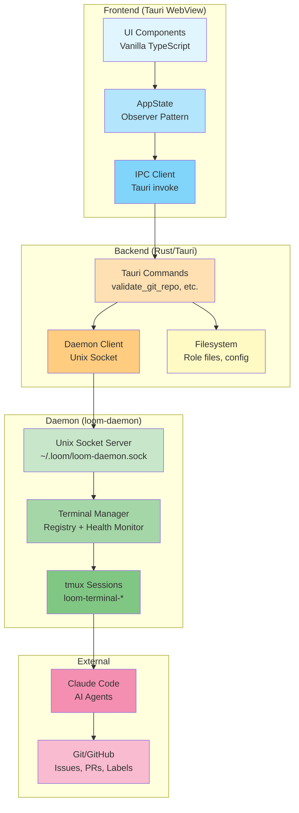
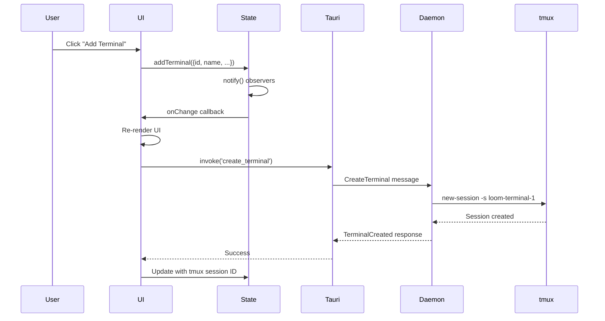
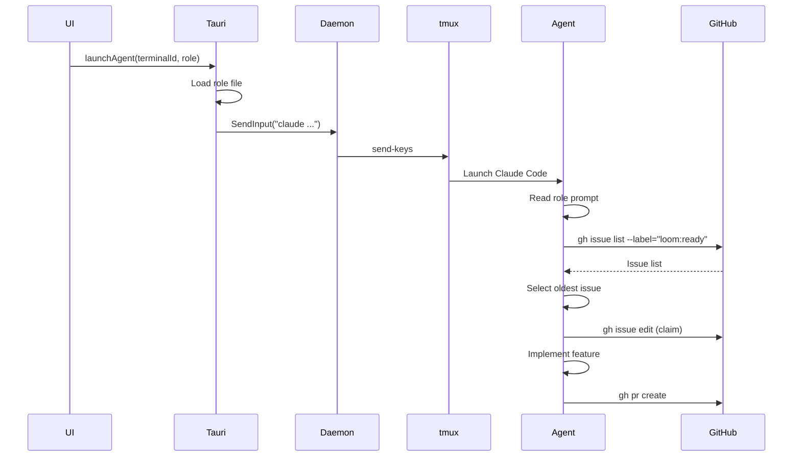
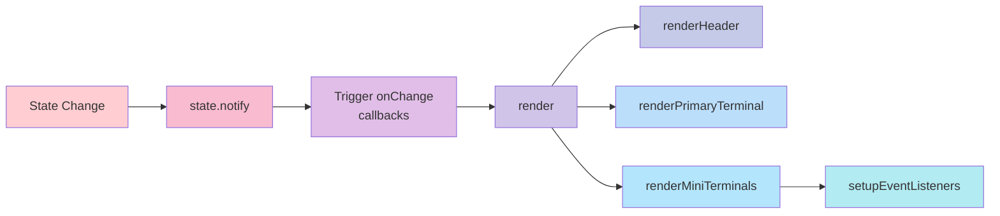
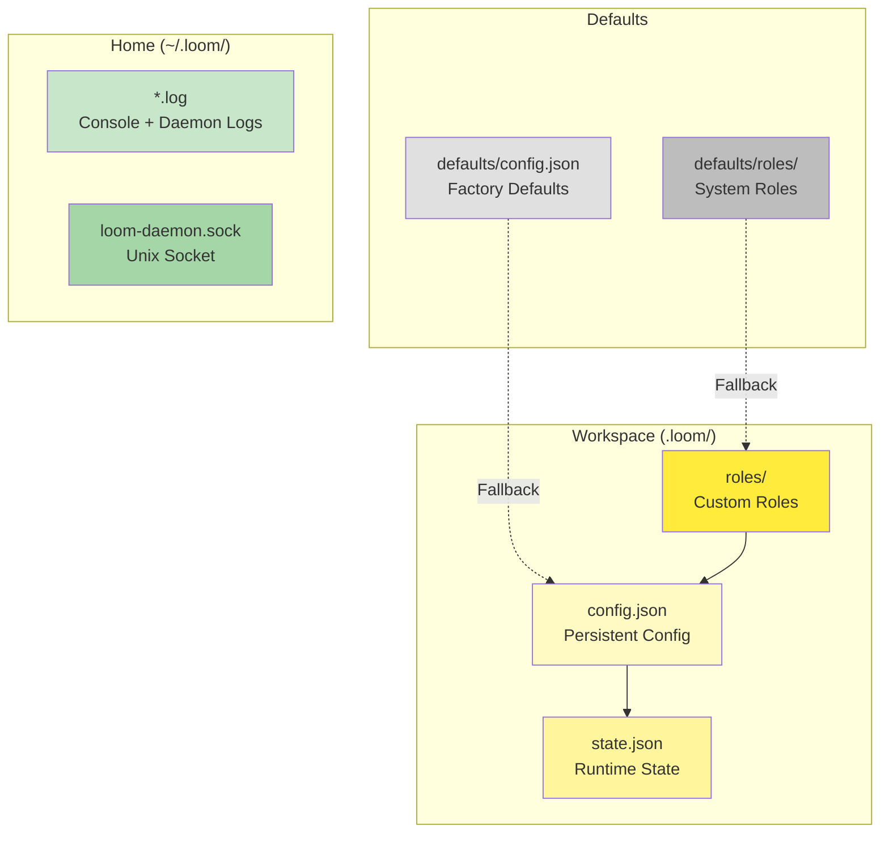
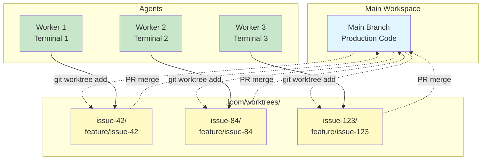
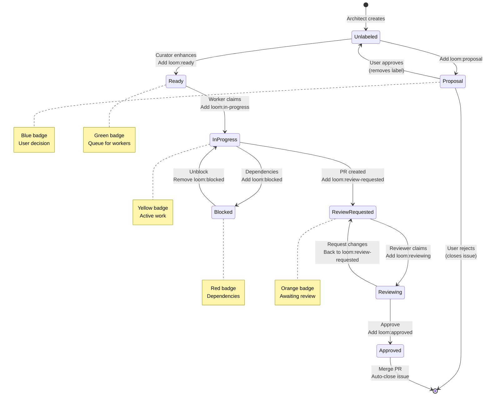
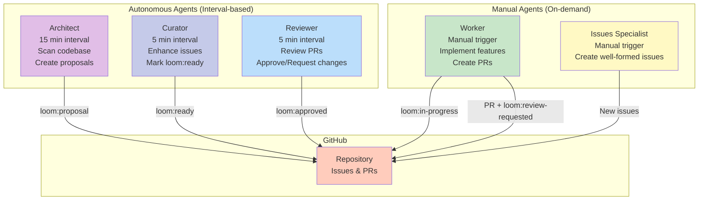
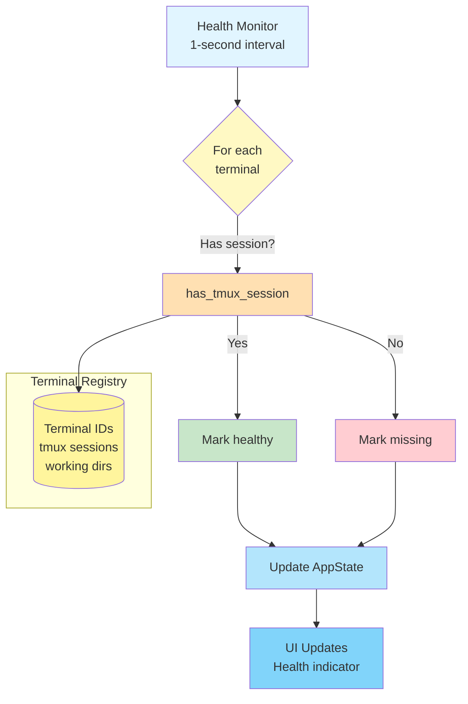
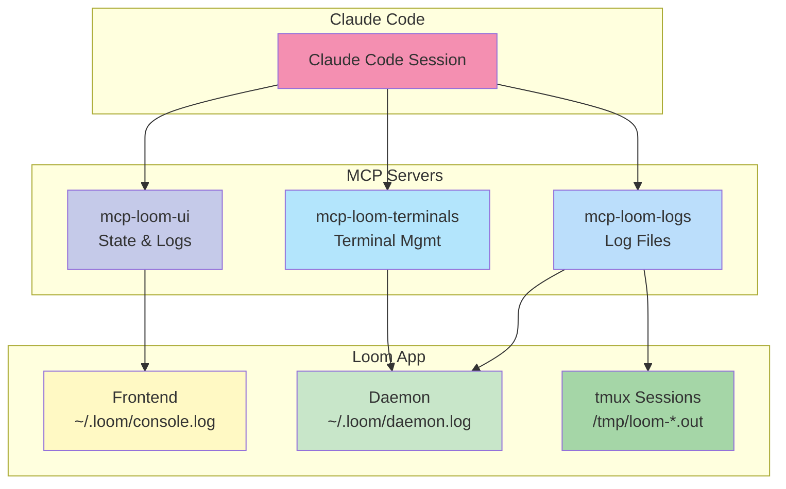

# Loom System Architecture

This document provides a visual overview of Loom's architecture, including component relationships, data flow, and key design patterns.

## High-Level Architecture



## Component Details

### Frontend Layer

#### UI Components
- **Location:** `src/main.ts`, `src/lib/ui.ts`
- **Technology:** Vanilla TypeScript + TailwindCSS
- **Responsibilities:**
  - Render terminal cards and workspace selector
  - Handle user interactions
  - Update based on state changes
  - Manage theme (light/dark mode)

#### AppState
- **Location:** `src/lib/state.ts`
- **Pattern:** Observer (Pub/Sub)
- **Responsibilities:**
  - Single source of truth for app state
  - Terminal management (add, remove, update)
  - Workspace path tracking
  - Notify observers on changes
- **Key Feature:** Automatic UI updates via `onChange()` callbacks

#### IPC Client
- **Location:** Throughout `src/` (via `@tauri-apps/api`)
- **Responsibilities:**
  - Bridge frontend to Rust backend
  - Type-safe command invocation
  - Async communication with backend

### Backend Layer

#### Tauri Commands
- **Location:** `src-tauri/src/main.rs`
- **Responsibilities:**
  - Validate git repositories
  - Read role files and metadata
  - Manage GitHub labels
  - Write console logs
  - Communicate with daemon

#### Daemon Client
- **Location:** `src-tauri/src/daemon_client.rs`
- **Responsibilities:**
  - Connect to Unix socket
  - Send/receive JSON messages
  - Handle daemon communication errors

#### Filesystem
- **Locations:**
  - Config: `.loom/config.json`
  - State: `.loom/state.json`
  - Roles: `defaults/roles/`, `.loom/roles/`
  - Logs: `~/.loom/*.log`

### Daemon Layer

#### Unix Socket Server
- **Location:** `loom-daemon/src/ipc.rs`
- **Socket:** `~/.loom/loom-daemon.sock`
- **Protocol:** JSON messages (internally tagged)
- **Responsibilities:**
  - Accept client connections
  - Route messages to handlers
  - Maintain connection pool

#### Terminal Manager
- **Location:** `loom-daemon/src/terminal.rs`
- **Responsibilities:**
  - Create/destroy tmux sessions
  - Maintain terminal registry
  - Send input to terminals
  - Read terminal output
  - Health monitoring

#### tmux Sessions
- **Socket:** `-L loom` (separate from system tmux)
- **Naming:** `loom-terminal-{id}`
- **Persistence:** Sessions survive app restart
- **Cleanup:** Auto-removed when app terminates

## Data Flow

### Terminal Creation Flow



### Agent Launch Flow



### State Update Flow



## Configuration Architecture



## Git Worktree Architecture



## Label-Based Workflow



## Agent Roles and Responsibilities



## Health Monitoring Architecture



## MCP Server Integration



## File Structure

```
loom/
├── src/                          # Frontend (TypeScript)
│   ├── main.ts                   # Entry point, event handlers
│   ├── lib/
│   │   ├── state.ts              # AppState (Observer pattern)
│   │   ├── config.ts             # Config file I/O
│   │   ├── ui.ts                 # Pure rendering functions
│   │   ├── theme.ts              # Dark/light mode
│   │   ├── workspace-*.ts        # Workspace lifecycle
│   │   ├── terminal-*.ts         # Terminal lifecycle
│   │   ├── agent-launcher.ts     # Agent initialization
│   │   ├── worktree-manager.ts   # Git worktree operations
│   │   └── health-monitor.ts     # Terminal health checks
│   └── style.css                 # Global styles + Tailwind
│
├── src-tauri/                    # Backend (Rust)
│   ├── src/
│   │   ├── main.rs               # Tauri commands
│   │   └── daemon_client.rs      # Daemon communication
│   ├── tauri.conf.json           # Tauri configuration
│   └── Cargo.toml                # Rust dependencies
│
├── loom-daemon/                  # Daemon (Rust)
│   ├── src/
│   │   ├── main.rs               # Daemon entry point
│   │   ├── ipc.rs                # Unix socket server
│   │   ├── terminal.rs           # Terminal manager
│   │   └── logging.rs            # Structured logging
│   └── Cargo.toml                # Daemon dependencies
│
├── .loom/                        # Workspace config (gitignored)
│   ├── config.json               # Persistent configuration
│   ├── state.json                # Runtime state
│   ├── roles/                    # Custom role definitions
│   └── worktrees/                # Git worktrees
│       ├── issue-42/
│       ├── issue-84/
│       └── issue-123/
│
├── defaults/                     # Default templates
│   ├── config.json               # Factory config
│   └── roles/                    # System role templates
│       ├── builder.md
│       ├── judge.md
│       ├── architect.md
│       └── curator.md
│
├── docs/                         # Documentation
│   ├── guides/                   # How-to guides
│   ├── adr/                      # Architecture decisions
│   ├── mcp/                      # MCP server docs
│   ├── api/                      # API reference
│   └── architecture/             # Architecture diagrams
│
└── mcp-*/                        # MCP server packages
    ├── mcp-loom-ui/
    ├── mcp-loom-logs/
    └── mcp-loom-terminals/
```

## Key Design Patterns

### Observer Pattern (State Management)

```typescript
class AppState {
  private terminals: Map<string, Terminal>
  private listeners: Set<() => void>

  private notify(): void {
    this.listeners.forEach(cb => cb())
  }

  onChange(callback: () => void): () => void {
    this.listeners.add(callback)
    return () => this.listeners.delete(callback)
  }
}
```

**Benefits:**
- Automatic UI updates on state changes
- Decoupled components
- Easy to test

### Pure Functions (Rendering)

```typescript
function renderTerminal(terminal: Terminal): string {
  // Same input → Same output
  return `<div>${terminal.name}</div>`
}
```

**Benefits:**
- Predictable behavior
- Easy to test
- Can be memoized

### Event Delegation

```typescript
// One listener on parent handles all child clicks
parent.addEventListener('click', (e) => {
  const card = e.target.closest('[data-terminal-id]')
  if (card) handleTerminalClick(card.dataset.terminalId)
})
```

**Benefits:**
- Fewer event listeners
- Works with dynamic content
- Better performance

## Technology Stack

- **Frontend:** TypeScript 5.9 (Strict), Vite 5, TailwindCSS 3.4
- **Backend:** Rust (Tauri 1.8.1)
- **Daemon:** Rust, tokio async runtime
- **Terminal:** tmux 3.3+
- **AI:** Claude Code (Anthropic)
- **VCS:** Git 2.37+, GitHub CLI
- **Testing:** Vitest (frontend), cargo test (backend), MCP servers

## See Also

- [API Reference](../api/README.md) - Complete API documentation
- [ADR-0001: Observer Pattern](../adr/0001-observer-pattern-state-management.md) - State management decisions
- [ADR-0008: tmux + Rust Daemon](../adr/0008-tmux-daemon-architecture.md) - Daemon architecture
- [Testing Guide](../guides/testing.md) - MCP testing and debugging
